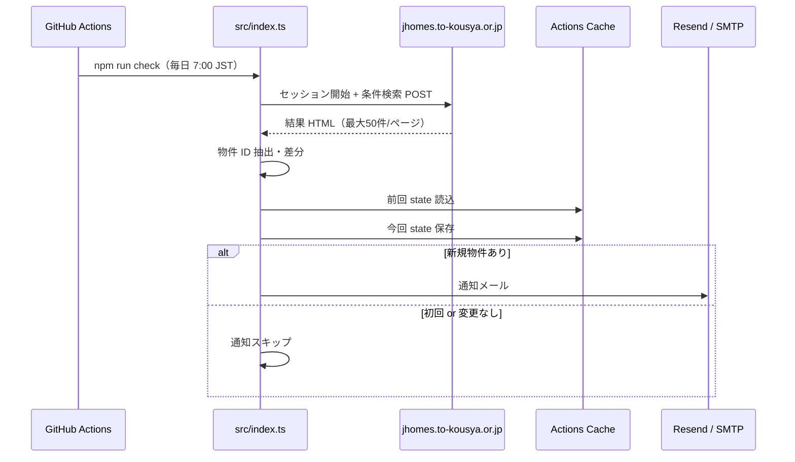

# アーキテクチャ

## 処理フロー

## モジュール

| ファイル | 役割 |
|----------|------|
| `src/jkk-client.ts` | Cookie 維持・Shift_JIS POST・JKK 検索 |
| `src/parse-listings.ts` | 結果 HTML から物件一覧 |
| `src/state.ts` | `.data/state.json` 読み書き |
| `src/filter.ts` | 任意の家賃上限フィルタ |
| `src/notify/` | メール送信（Resend API / SMTP） |
| `src/index.ts` | オーケストレーション |

## 物件 ID

`{mskKbn}-{jyutakuCd}-{yusenKbn}`（詳細ボタン `senPage` から取得）

## 外部依存

- JKK Web（非公式 API・HTML スクレイピング）
- Resend API（本番デフォルト）または SMTP（`NOTIFY_PROVIDER=smtp`）

HTML 変更でパーサが壊れるリスクあり。取得失敗時はエラーメールを送る。
